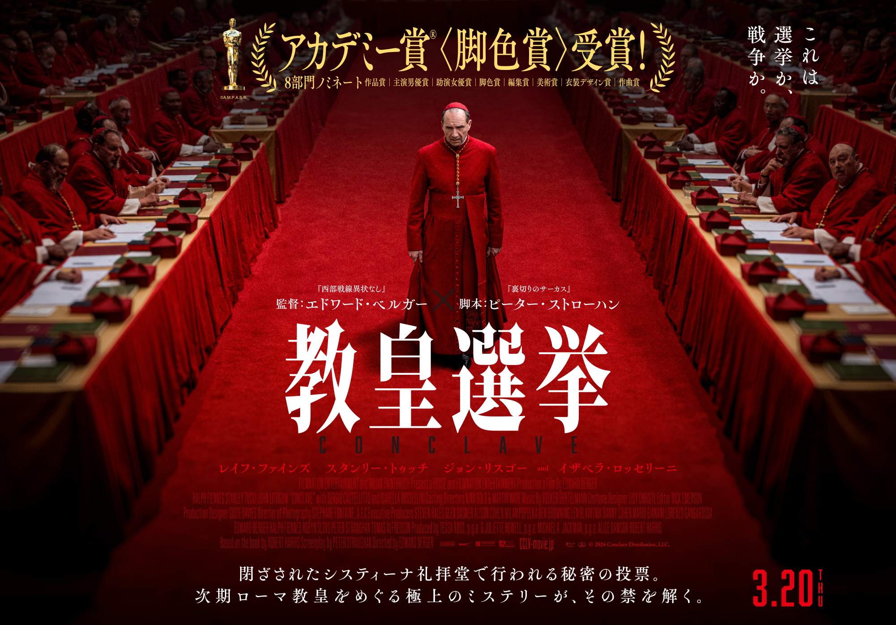

<html>
<head>
  <title>むーくの好きだった映画リスト</title>
  
</head>
<body>

  <h1>むーくの好きだった映画リスト 2023年8月～</h1>
  

    2023年 
【8月の公開映画で好きだった作品】『Barbie／バービー』です。茶話オフ会をセッティングしました 
　　　https://libecity.com/room_list?room_id=0KjLw3hIqstBaIb4RoCR 
【9月の公開映画で好きだった作品】『アステロイド・シティ』『ファルコン・レイク』『熊は、いない』『メロスたち』『福田村事件』 
【10月の公開映画で好きだった作品】『バーナデッド　ママは行方不明』『ロスト・キング　500年越しの運命』 
【11月の公開映画で好きだった作品】『人生は、美しい』『REALITY』『正欲』 
【12月の公開映画で好きだった作品】『月』『市子』『ディス・マジック・モメント』『PERFECT DAYS』  
    
2024年 
【1月の公開映画で好きだった作品】『ファースト・カウ』『ナイアド』『〇月〇日区長になる女』『ミツバチと私』 
【2月の公開映画で好きだった作品】『哀れなるものたち』『夜明けのすべて』『熱のあとに』 
【3月の公開映画で好きだった作品】『落下の解剖学』『青春ジャック』『オッペンハイマー』 
【4月の公開映画で好きだった作品】『14歳の栞』『パストライブス』『52ヘルツのクジラたち』 
【5月の公開映画で好きだった作品】『悪は存在しない』『ミセス・クルナスvs.ジョージW.ブッシュ』 
【6月の公開映画で好きだった作品】『ありふれた教室』『関心領域』『かくしごと』『あんのこと』『違国日記』 
【7月の公開映画で好きだった作品】『チャレンジャーズ』『大いなる不在』『医学生 ガザへ行く』 
【8月の公開映画で好きだった作品】『クレオの夏休み』『マミー』『ブルーピリオド』 
【9月の公開映画で好きだった作品】『ナミビアの砂漠』『ぼくのお日さま』 
【10月の公開映画で好きだった作品】『HAPPYEND』『ぼくが生きてる、ふたつの世界』 
【11月の公開映画で好きだった作品】『国境ナイトクルージング』 
【12月の公開映画で好きだった作品】『ロボット・ドリームス』『地獄のSE』『クラブ・ゼロ』 
2024年の観賞本数　216本  
    
2025年 
【1月の公開映画で好きだった作品】 『型破りな教室』『I Like Movies』『アプレンティス』『敵』『花束』 
【2月の公開映画で好きだった作品】 『リアル・ペイン』『ザ・ルーム・ネクスト・ドア』『アノーラ（日本公開は2月。観たのは去年リスボンで）』 
【3月の公開映画で好きだった作品】 『名もなき者』『陪審員２番』『DiDi 弟弟』『エミリア・ペレス』 
【4月の公開映画で好きだった作品】 『教皇選挙』『TATAMI』『ミッキー17』『悪い夏』『アブラハム渓谷』『トランケ・ラウケン』『天国の日々』 
【5月の公開映画で好きだった作品】 『今日の空が一番好き、とまだ言えない僕は』『サブスタンス』『未完成の映画』 
【6月の公開映画で好きだった作品】 『国宝』『ルノワール』『親友かよ』『能登デモクラシー』『cocoon（by 河合宏樹監督）』 
【7月の公開映画で好きだった作品】 『無名の人生』『テイクアウト』『選挙と鬱』『アジアのユニークな国』『フォーチュンクッキー』 
【8月の公開映画で好きだった作品】 『キムズビデオ』『私たちが光と思うすべて』『鬼滅の刃 無限城編』『アイム・スティル・ヒア』 
【9月の公開映画で好きだった作品】 『遠い山なみの光』『見晴らし世代』『ふつうの子ども』『バード ここから羽ばたく』 
【10月の公開映画で好きだった作品】 『ホーリー・カウ』『女性の休日』『LOVE』『家庭裁判所 第３H法廷』 
【11月の公開映画で好きだった作品】『旅と日々』『医の倫理と戦争』『佐藤さんと佐藤さん』 
【12月の公開映画で好きだった作品】『ネタニヤフ調書』『兄を持ち運べるサイズに』『みんなおしゃべり』『BlackBoxDiaries』 
2025年の観賞本数　240本  
  

    

  ＊これまでのリベ活歴＊  
2023年 
8月23日　 リベシティに入会しました～🐣 
9月2日　　地球部１周年記念アニバーサリー　東京クルージング🛳️にキャンセル待ちでドタ参加🌟 
9月3日　　スキルマーケット・プロフィール文章作成サポート会＠横浜に参加。プロフィール大改編しました📝 
9月10日　 自分主催で、映画『Barbie／バービー』を見てゆる～く語る第一回シネマ茶話会＠東京オフィスを開催
　　　　　～10月には検定試験、11月には韓国家族旅行あり、この間 オフ会参加はスローダウン。。。～ 
11月26日　観音崎での チェアリング・焚火会に参加 🔥 
12月2日　川崎にて、にんにくオフ会に参加 🧄 
12月29日　oviceにて、オンラインのシネマオフ会を主催しました🎥https://libecity.com/room_list?room_id=VJefTidWS5jgQPYViYVR  

2024年 
1月28日　第二回シネマオフ会＠新橋オフィス🎬 
3月24日　第三回シネマオフ会＠新橋オフィス 
3月31日　代々木公園 お花見オフ会🌸 
5月11日　第四回　シネマオフ会＠新橋オフィス 
7月21日　第五回　シネマオフ会＠新橋オフィス 
9月23日　第六回　シネマオフ会＠新橋オフィス 
11月29日 第七回　シネマオフ会＠新橋オフィス 
2025年 
1月11日 第八回　シネマオフ会＠新橋オフィス 
3月15日 第九回　シネマオフ会＠新橋オフィス 
5月25日 第十回　シネマオフ会＠新橋オフィス 
7月27日 第十一回　シネマオフ会＠新橋オフィス 
9月15日 第十二回　シネマオフ会＠新橋オフィス 
11月24日 第十三回　シネマオフ会＠新橋オフィス 
2026年 
1月25日第十四回　シネマ茶話会＠新橋オフィス 
3月21日第十五回　シネマ茶話会＠新橋オフィス 
5月24日第十六回　シネマ茶話会＠新宿オフィス 

</body>
</html>
